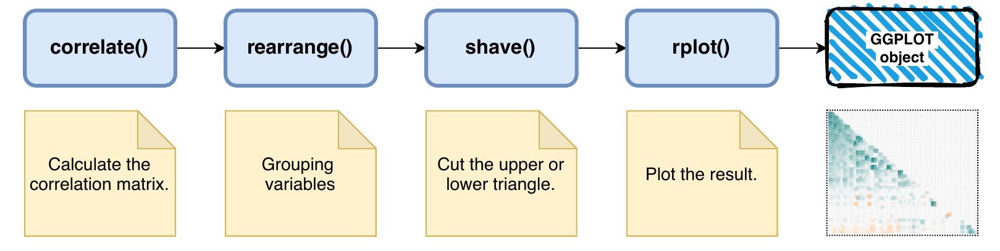

One key task when you're performing your descriptive analysis during the EDA is the correlation analysis. During this task you are looking for linear relationships between your features that could be very useful for some models.

Probably, the best way to see correlations between variables is to use scatterplots, but in most of time you're working with a high dimensional dataset with a high number of variables, in these situations you have two major problems:

-   It's a high computational task to plot lots of scatter plot, specially if you have a big dataset.

-   Even if you can plot all scatterplots at once, the readability of the charts will be horrible, and you'll not see nothing useful.

You can solve this problem by calculating the coefficient of correlation and instead of have lots of scatterplots, you'll have a matrix showing how much it correlates your variables, assume a range from -1 to 1, high negatively correlated to high positively correlated, respectively. This is definitely much faster to plot and easy to interpret.

### Misinterpretation of the coefficient of correlation

Before start coding, it's important understanding two very important topics about correlation analysis to drift reliable conclusions.

#### First point

Sometimes, we misinterpret the value of coefficient of correlation and establish the cause-and-effect relationship, i.e. one variable causing the variation in the other variable. Actually, we cannot interpret in this way unless we have a powerful motive beside just the coefficient value.

Correlation coefficient gives us a quantitative determination of a relationship between two variables X and Y, not information about the association between the two variables. Causation implies an invariable sequence --- A always leads to B, whereas correlation is a measure of mutual association between two variables.

#### Second point

Another point that we need to be aware of is the exist factors that influencing the size of the correlation coefficient and can also lead to misinterpretation, like:

-   The size of the coefficient is very much dependent upon the variability of measured values in the correlated sample. The greater the variability, the higher will be the correlation, everything else being equal.

-   The size of the coefficient is altered when an investigator selects an extreme group of subjects to compare these groups regarding certain behavior. The coefficient got from the combined data of extreme groups would be larger than the coefficient got from a random sample of the same group.

-   Addition or dropping the extreme cases from the group can lead to change on the size of the coefficient. Addition of the extreme case may increase the size of correlation, while dropping the extreme cases will lower the value of the coefficient.

With that in mind, it's a good idea to do a standardized step before looking for correlations, to minimize variability and extreme values.

### How to do a correlation analysis in R?

As everything in R, here there is also plenty packages to calculate and plot coefficients of correlation. It's up to you to choose which package is better for your analysis.

The objective of this article is to help you showing good approachs using mainly two packages:

-   corrr: descrição

-   corrplot: descrição

### Data

As a dataset for this tutorial I'll use some data from a personal project in development. The data was collected from a public API from a eletronic game called League of Legends.

*League of Legends* is one of the most popular video games in the world. It is played [by over 100 million active users](http://www.riftherald.com/2016/9/13/12865314/monthly-lol-players-2016-active-worldwide) every single month. Each team has a base they must guard from their opponents while simultaneously attacking their opponent's base , there is the Blue team, whose base is located in the lower left part of the map, and the Red team, whose base is located in the upper right part of the map. At the back of each team's base there is a building called The Nexus. You win the game by destroying the enemy team's Nexus.

During the match there is lot of statistics that are collected from each player (5 in each team) and was theses statistics that I collected. The game also have a ranking by country and according your performance you get a specific tier, that can be: iron, bronze, silver, gold, platinum, diamond, master, grandmaster and challenger, following the batter to worse order, respectivly.

Just to simplify the example, I'll show just the data for one particularly tier, Diamond players.

I choose this dataset because we have a lot of variables, high dimensionality, and look for linear correlations can be useful to build our model in the future.

Let's begin!

```{r}
# libraries used in this tutorial
library(tidyverse)
library(corrr)
library(corrplot)
library(tidyquant) # pallete

# dataset cleaned
lol_diamond_tbl <- read_csv("data/lol_diamond_numeric_final.csv")


lol_diamond_tbl %>% glimpse()

```

This is a cleaned dataset, and the cleaning script can be found in github repo. Besides that, the description of the variables used here can be find on [kaggle kernel](https://www.kaggle.com/dsluciano/league-of-legends-match-statistics) created by me, if you have any question please let me know.

### Using corplot package

This is a well known library, that R users normaly choose. The downside from corplot package is we don't have a ggplot object, and because of that is most dificult customize the plot with something that you want.

The procedure to plot the correlation coeficients using corplot is:

1.  calculate the correlation matrix
2.  apply the corrplot() function
3.  customize

Simple is that, but it's not so beatiful and it's not the best chart to put in some report. Besides that, few people know that you can clusterize variables to improve the visualization.

```{r}
library(corrplot)

# basic procedure
corr_matrix_train_mtx <- lol_diamond_tbl %>% cor()
corrplot(corr_matrix_train_mtx)

```

So we need apply some customization, first I will apply a change in the method, to put a square in the square place. This way we can get the second plot. But I think that is better without the grid, so we change from square to color (third plot). Here we have a problem, as a correlation matrix is mirrored, you have so much information most that you really need, so we take just the inferior triangle and get the plot 4. We can agree that red text is not the most indicate color to put in your plot, for that we can change tl.col to black and also put into a smaller font size with tl.cex (plot 5). And the most fun part, we can rearrenge the variable take in consideration some method, the corrplot function accept 5 different ways: AOE, FPC, hclust and alphabet (look the documantation to see more).

```{r}
# second plot
corrplot(corr_matrix_train_mtx, method = "square")

# third plot
corrplot(corr_matrix_train_mtx, method = "color")

# fourth plot
corrplot(corr_matrix_train_mtx, type = "lower", method = "color")

# fifth plot
corrplot(corr_matrix_train_mtx, method = "color", type = "lower",
         tl.col = "black", tl.cex = 0.5)

# sixth plot
corrplot(corr_matrix_train_mtx, method = "color", type = "lower",
         tl.col = "black", tl.cex = 0.5,
         order = "hclust",)

```

Look that this plot really help you to see different groups of variables that have similar correlations, and can be a point to investigate specific groups later.

### Using corrr package

This second approach is the most tidy way to perform a correlation analysis. We can considered one specific structure to do that, following the image bellow.



It's incridible straithforward, and you just need to tune some specific parameters. The standard configuration is the plot 1 below, just applying the all the function showed before.

```{r}
library(corrr)

# plot 1
lol_diamond_tbl %>% 
    correlate() %>% 
    rearrange() %>% 
    shave() %>%
    # rplot need to receive a correlation matrix
    rplot()

```

After I'll set the PCA method for rearrange the variables, shape = 15 and specific colors, get the plot 2. And at the end, I will set the angle to 45 and hjust = 1, to put the axis text in right place plot 3.

The corrr library can also use a lot of different clustering methods for rearrange the variables, and you can get the full list from the seriate package.

```{r}
# I think that is a better way to see correlations using colors and shapes!
library(corrr)
lol_diamond_tbl %>% 
    correlate(use = "pairwise.complete.obs") %>% 
    rearrange(method = "PCA") %>% 
    corrr::shave() %>%
    # rplot need to receive a correlation matrix
    rplot(shape = 15, colours = c("darkorange", "white", "darkcyan")) +
    theme_minimal() +
    theme(
        axis.text.x = element_text(angle = 45, hjust = 1)
    )

```

And one more vantage in to use corrr is that you can create plotly interactive plots and hover throught specific squares and investigate more precise the values of coefficients of correlation and the variable in x and y axis.

```{r}
g <- lol_diamond_tbl %>% 
    correlate(use = "pairwise.complete.obs") %>% 
    rearrange(method = "PCA") %>% 
    corrr::shave() %>%
    # rplot need to receive a correlation matrix
    rplot(shape = 15, colours = c("darkorange", "white", "darkcyan")) +
    theme_minimal() +
    theme(
        axis.text.x = element_text(angle = 45, hjust = 1)
    )


plotly::ggplotly(g)

```

[video]

Now that you already have a fully understanding in how to plot a good chart to investigate the correlation between your variables, I'll show you one specific approach to a more applicable task in your modeling workflow.

See the correlation between all variables is usefull, but as we are investigating a correlation against one specific variable (target), one better way is to look specific to this variable.

### Creating the plot\_cor() function

In this section I'll show you this two functions that you can use to create beatifull plots and see clearly which variable can contribute more using this kind of analysis.

First we need the get\_cor() function, that will return the correlation matrix to pluguin into plot\_cor() function later.

```{r}

# getting the correlation matrix
get_cor <- function(data, target, use = "pairwise.complete.obs",
         fct_reorder = FALSE, fct_rev = FALSE) {
    
    # meta programming to capture the variables
    # like tidy functions
    feature_expr <- enquo(target)
    feature_name <- quo_name(feature_expr)
    
    # get the corralating matrix
    # and also ensuring that the data is in the
    # right format
    data_cor <- data %>% 
        mutate(across(where(is.character), as_factor)) %>% 
        mutate(across(where(is.factor), as.numeric)) %>% 
        cor(use = use) %>% 
        as_tibble() %>% 
        mutate(feature = names(.)) %>% 
        select(feature, !! feature_expr) %>% 
        filter(!(feature == feature_name))
    
    # conditionals to sort the variables
    # very usefull to plot
    if (fct_reorder) {
        data_cor <- data_cor %>% 
            mutate(feature = fct_reorder(feature, !! feature_expr)) %>% 
            arrange(feature)
    }
    
    if (fct_rev) {
        data_cor <- data_cor %>% 
            mutate(feature = fct_rev(feature)) %>% 
            arrange(feature)

    }
    
    return(data_cor)
    
}

```


Second, we need the plot function

```{r}
# this function plot the correlation scores in order of values
# and have a lot of parameters that can be used to 
# fully customize your plot as you want
plot_cor <- function(data, target, fct_reorder = FALSE, fct_rev = FALSE,
                     include_lbl = TRUE, lbl_precision = 2, lbl_position = "outward",
                     size = 2, line_size = 1, vert_size = 1,
                     color_pos = palette_light()[[1]],
                     color_neg = palette_light()[[2]]) {
    
    # meta programming to capture the variables
    # like tidy functions
    feature_expr <- enquo(target)
    feature_name <- quo_name(feature_expr)
    
    
    data_cor <- data %>% 
        get_cor(!! feature_expr, fct_reorder = fct_reorder, fct_rev = fct_rev) %>% 
        
        # used as label, and also putting the precision of the numbers
        mutate(feature_name_text = round(!! feature_expr, lbl_precision)) %>% 
        
        # labeling the correlation as negative and positive
        mutate(Correlation = case_when(
            (!! feature_expr) >= 0 ~ "Positive",
            TRUE ~ "Negative") %>% as.factor())
    
    g <- data_cor %>% 
        ggplot(aes_string(x = feature_name, y = "feature", group = "feature")) +
        geom_point(aes(color = Correlation), size = size) +
        geom_segment(aes(xend = 0, yend = feature, color = Correlation), size = line_size) +
        geom_vline(xintercept = 0, color = palette_light()[[1]], size = vert_size) +
        expand_limits(x = c(-1, 1)) +
        theme_tq() +
        scale_color_manual(values = c(color_neg, color_pos))
    
    if (include_lbl) g <- g + geom_label(aes(label = feature_name_text), hjust = lbl_position)
    
    return(g)

}


g2 <- plot_cor(lol_diamond_tbl, totalDamageDealt, fct_reorder = T)


```

And that is the final result. Look that you can change the target variable and see the correlation between other variables too, just neet to change the target parameter.

[plot g2]

I hope you enjoyed this tutorial, and any question please let me know or reach me on social network:

LinkedIn:
GitHub:

<https://www.yourarticlelibrary.com/statistics-2/correlation-meaning-types-and-its-computation-statistics/92001>